# TazunaBot

A Discord bot for managing your umamusume club and other nifty uma commands. 
Any questions? Join the discord https://discord.gg/5BW4gSUVSz
---

## 🚀 Getting Started
Follow these steps to run the bot locally. You can also host this bot on a free server like pella.


### 1. Install dependencies
Before you start, you'll need to install [NodeJS](https://nodejs.org/en/download/) and [create a Discord app](https://discord.com/developers/applications). Feel free to name the bot anything you want and upload a nice icon.

### 2a. Clone the repository
```
git clone https://github.com/JustWastingTime/TazunaDiscordBot.git
cd TazunaDiscordBot
npm install
```

### 2b. Fork the repository
If you'd like to still receive updates on the bot (as it is a Work in Progress), you can fork the repo instead of cloning it. I'm not gonna expand much on this as you should have some knowledge on this already if you are picking this option.

### 3. Create your credentials file
Rename .env.sample to just .env.  
Head to the discord app you just created and copy the application id (`APP_ID`) and public key (`PUBLIC_KEY`) into the .env file. Then head into the Bot page and generate a Bot Token and save it as (`DISCORD_TOKEN`) in the .env.
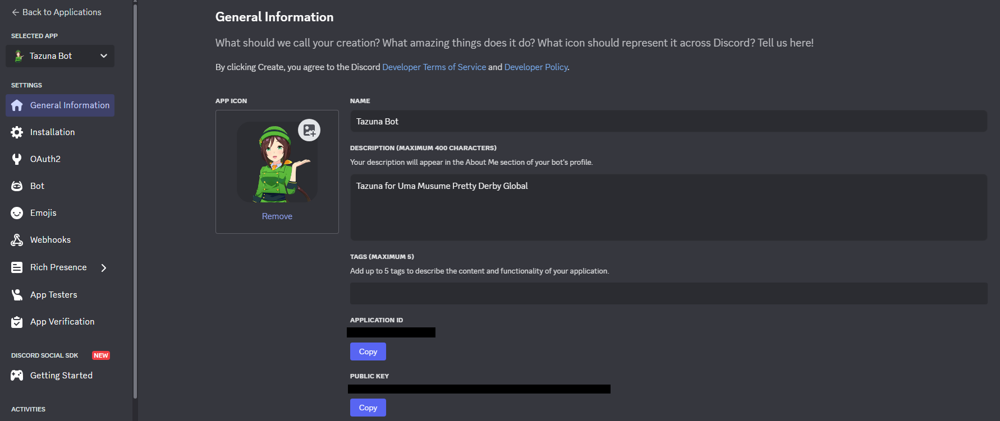


### 4. Install slash commands

The commands are set up in `commands.js` (more on the commands later). All of the commands in the `ALL_COMMANDS` array at the bottom of `commands.js` will be installed when you run the `register` command configured in `package.json`:

```
npm run register
```

### 5. Run the app

After your credentials are added, go ahead and run the app:

```
npm run start
```

### 6a. Set up interactivity

The project needs a public endpoint where Discord can send requests. To develop and test locally, you can use something like [`ngrok`](https://ngrok.com/) to tunnel HTTP traffic.

Install ngrok if you haven't already, then start listening on port `3000`:

```
ngrok http 3000
```

You should see your connection open:

```
Tunnel Status                 online
Version                       2.0/2.0
Web Interface                 http://127.0.0.1:4040
Forwarding                    https://1234-someurl.ngrok.io -> localhost:3000

Connections                  ttl     opn     rt1     rt5     p50     p90
                              0       0       0.00    0.00    0.00    0.00
```

Copy the forwarding address that starts with `https`, in this case `https://1234-someurl.ngrok.io`, then go to your [app's settings](https://discord.com/developers/applications).

On the **General Information** tab, there will be an **Interactions Endpoint URL**. Paste your ngrok address there, and append `/interactions` to it (`https://1234-someurl.ngrok.io/interactions` in the example).

Click **Save Changes**, and your app should be ready to run 🚀
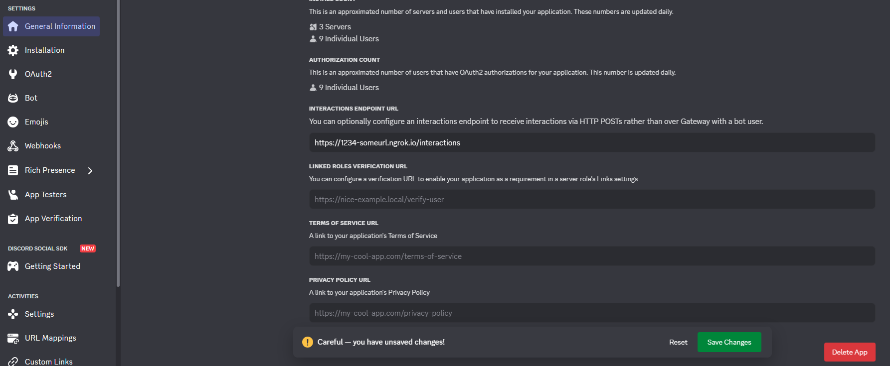

### 6b. Using free hosting
Sign up on a free web app hosting service such as pella.app and select Web App. Select the Express JS type and upload the current folder as a zip. In this case, do not upload the .env file and instead copy down the .env keys into the settings panel of your web app. Save and press start.  
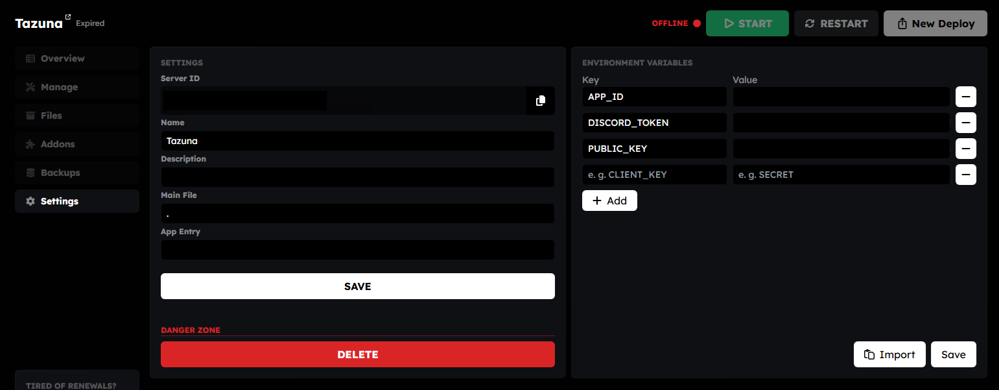

Go to the Manage tab and copy the domain given here. On the **General Information** tab, there will be an **Interactions Endpoint URL**. Paste your address there, and append `/interactions` to it (`https://someweirdname.onpella.app/interactions`).

Click **Save Changes**, and your app should be ready to run 🚀


## ⭐ Commands
Here are the features of the bot. Some of them are still a Work in Progress.  

`/uma` - Looks up information on a specific uma. Shows their unique skill, aptitudes and skills. Able to accept some common aliases as input. Also able to lookup variants such as McQueen Anime.  
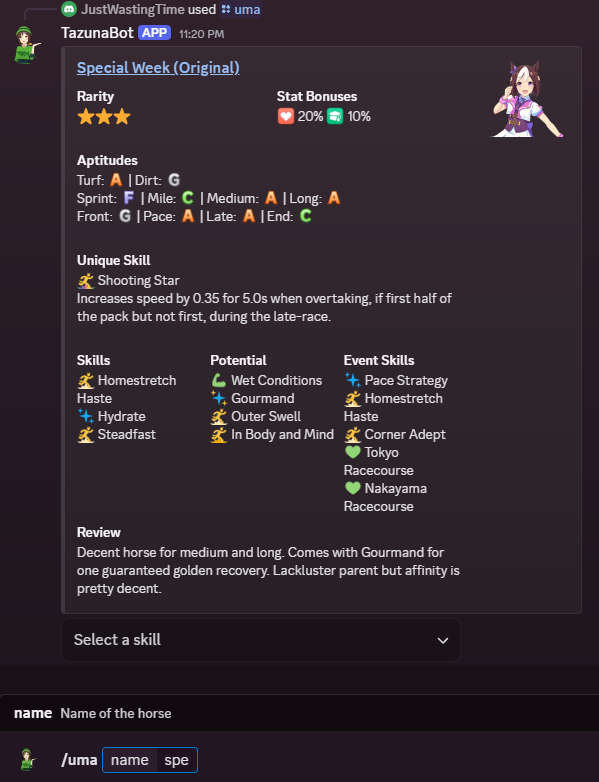

`/skill` - Looks up information on a specific skill and explained in a more detailed explanation than the vague descriptions in game.  
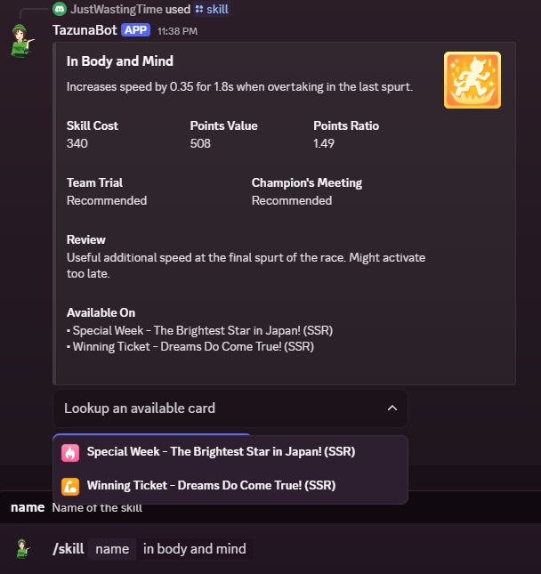

`/supporter` - Looks up information on a specific Supporter Card. Able to accept rarity as input; if you're looking for Kitasan Black SSR, you can type /supporter Kitasan SSR and it will work. Also able to limit the result to a specific Limit Break.  
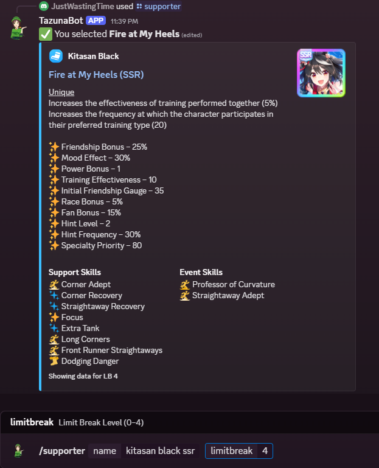

`/event` - Looks up information on a specific supporter event, uma event or generic event. (This is slowly getting updated, is a WIP)  
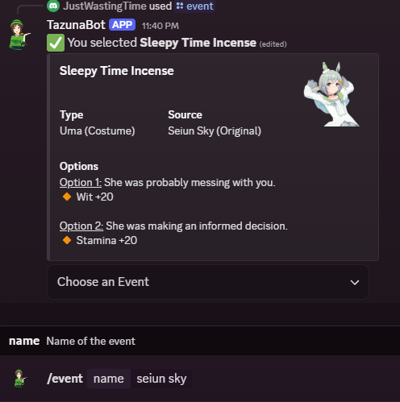

`/race` - Looks up information on a specific race. Can filter by year and grade  


`/cm` - Looks up information on a specific Champion's Meeting  
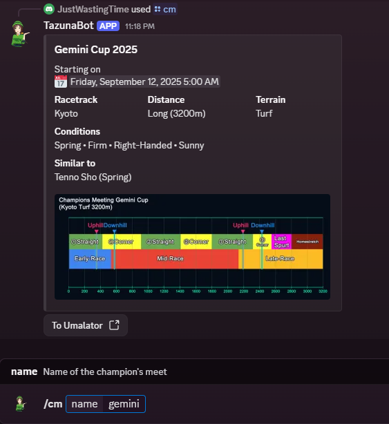

`/parse` - Parses an image of your uma's final result page and tries to generate an umalator link (This is a WIP and is not functional yet)  


`/trainer` - Looks up information on a specific trainer in your club. Leaving it blank shows your profile. [REQUIRES SHEET SETUP]  
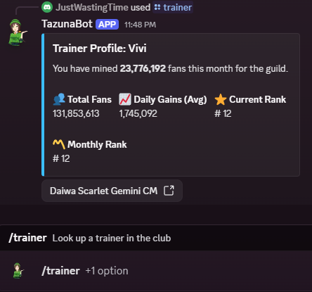

`/leaderboard` - Looks up the current club members' rankings. Can change mode between monthly and total. Default is monthly. [REQUIRES SHEET SETUP]  
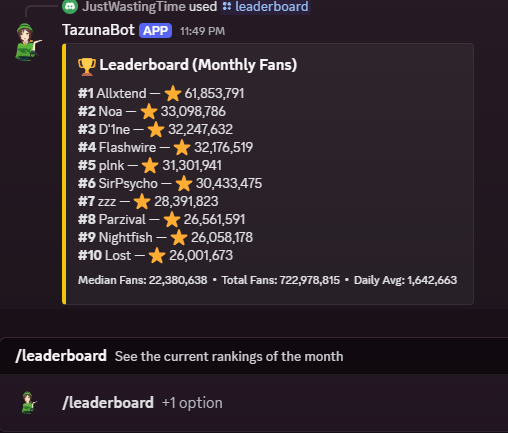

`/log` - Allows users to upload their fancount into the google sheets. [REQUIRES SHEET SETUP]  
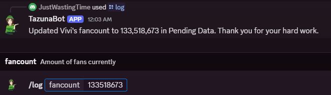

`/register` - Saves an umalator link into your trainer profile for easy access and comparison with club mates. Only 5 save slots. [REQUIRES SHEET SETUP]  


`/apply` - Allows new users to apply to your guild and setup a profile. Needs their uma name, uma id and total fan count as input. [REQUIRES SHEET SETUP]  


`/setchannel` - Sets the channel in which new member applicants will appear in. A user (ideally an admin/moderator only channel) will approve this applicant before the trainer profile is added to the sheets and bot. (Work in Progress) [REQUIRES SHEET SETUP]  


## ⭐ Setting up the sheets
Work in Progress.  

## ⭐ Changing the emojis
Work in Progress.  

## ⭐ Parsing images
Work in Progress.  